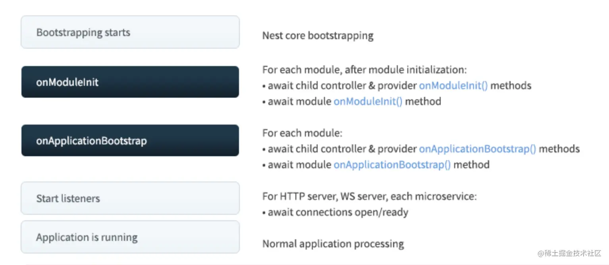
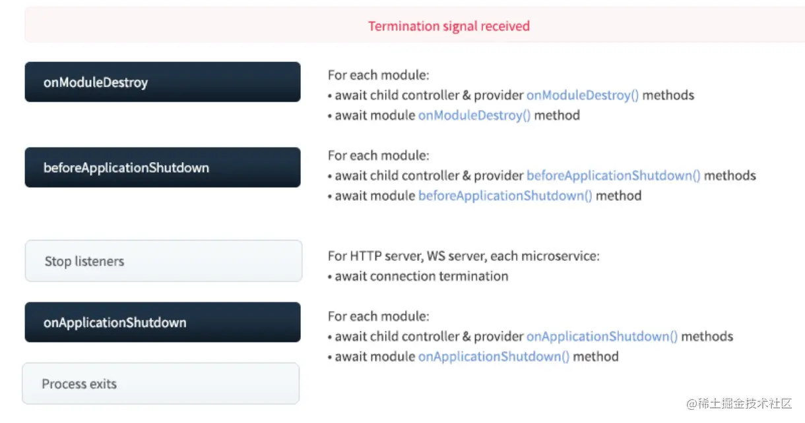

### 7 多种Provider

- 这些自定义 provider 的方式里，最常用的是 useClass，不过我们一般会用简写，也就是直接指定 class。useClass 的方式由 IOC 容器负责实例化，我们也可以用 useValue、useFactory 直接指定对象。useExisting 只是用来起别名的，有的场景下会用到。

- 注入可通过构造器，也可通过属性

### 全局模块和生命周期

#### 全局模块

- 在一个Module中使用另一个Module需要 exports + imports, 若有多个Module需要使用，可以使用全局模块。
可在待引入的模块中添加 @Global(),此时便可去除exports。  

#### 生命周期

Nest 在启动的时候，会递归解析 Module 依赖，扫描其中的 provider、controller，注入它的依赖。

全部解析完后，会监听网络端口，开始处理请求。

首先，递归初始化模块，会依次调用模块内的 controller、provider 的 onModuleInit 方法，然后再调用 module 的 onModuleInit 方法。

全部初始化完之后，再依次调用模块内的 controller、provider 的 onApplicationBootstrap 方法，然后调用 module 的 onApplicationBootstrap 方法

先调用每个模块的 controller、provider 的 onModuleDestroy 方法，然后调用 Module 的 onModuleDestroy 方法。

之后再调用每个模块的 controller、provider 的 beforeApplicationShutdown 方法，然后调用 Module 的 beforeApplicationShutdown 方法。

然后停止监听网络端口。

之后调用每个模块的 controller、provider 的 onApplicationShutdown 方法，然后调用 Module 的 onApplicationShutdown 方法。

之后停止进程。

beforeApplicationShutdown 是可以拿到 signal 系统信号的，比如 SIGTERM。

以上所有声明周期函数均支持异步

